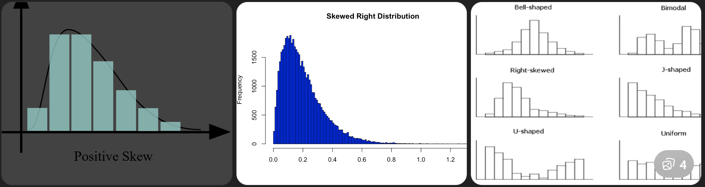

# 📊 MLF — Data Processing & Basics

---

## 🔹 1. Types of Encoding

### ✅ Nominal Encoding

Used for categorical data with **no order**.

**Example:**
Color → {Red, Blue, Green}

* Usually implemented using **One-Hot Encoding**

---

### ✅ Ordinal Encoding

Used when **order matters**.

**Example:**
Low < Medium < High

**Encoding:**

* Low = 1
* Medium = 2
* High = 3

---

### ✅ One-Hot Encoding

Converts categories into **binary columns**.


**Pros:**

* ✔ Avoids false ordering

**Cons:**

* ❌ Increases dimensionality

---

### ✅ Label Encoding

Assigns integer values to categories.

**Example:**

* Dog = 0
* Cat = 1
* Cow = 2

**⚠ Problem:**
Model may assume order (0 < 1 < 2)

---

### ✅ Frequency Encoding

Replaces category with its frequency/count.

| City   | Count |
| ------ | ----- |
| Delhi  | 50    |
| Jaipur | 20    |

**✔ Useful for large datasets**

---

## 🔹 2. SMOTE Technique

**Full Form:** Synthetic Minority Oversampling Technique

**Purpose:**

* Used for **imbalanced datasets**
* Creates synthetic samples for minority class

**How it works:**

1. Pick a minority class sample
2. Find nearest neighbors
3. Generate synthetic points between them

**Advantages:**

* ✔ Avoids overfitting vs duplication
* ✔ Improves model performance

---

## 🔹 3. Five Number Summary

Describes data distribution:

* Minimum
* Q1 (25th percentile)
* Median (Q2, 50th percentile)
* Q3 (75th percentile)
* Maximum

**Uses:**

* ✔ Box plots
* ✔ Outlier detection

---

## 🔹 4. Variable & Random Variable

### ✅ Variable

Any measurable feature.

**Examples:**

* Age
* Height
* Marks

---

### ✅ Random Variable

A variable whose value depends on chance.

**Types:**

* **Discrete** → Countable (e.g., dice roll)
* **Continuous** → Range (e.g., height, weight)

---

## 🔹 5. Types of Data

### 🔢 Numerical Data (Quantitative)

* **Discrete:** Countable (number of students)
* **Continuous:** Real values (temperature)

---

### 🔤 Categorical Data (Qualitative)

* **Nominal:** No order (color)
* **Ordinal:** Ordered (rank)

---

## 🔹 6. Scikit-Learn Tools

### ✅ StandardScaler

Standardizes features (mean = 0, variance = 1)


---

### ✅ OneHotEncoder

Converts categorical variables into binary columns

---

### ✅ SimpleImputer

Fills missing values.

**Strategies:**

* Mean
* Median
* Most frequent

---

### ✅ Linear Regression

Predicts continuous output.


**Key Points:**

* ✔ Supervised learning
* ✔ Finds best-fit line

---

## 🔹 7. Outlier Detection

### ✅ Z-Score Method


* Measures how far a value is from mean
* Sensitive to extreme values

---

### ✅ IQR Method

```id="iqr02"
IQR = Q3 - Q1
```

**Outlier Range:**

* Lower Bound = Q1 − 1.5 × IQR
* Upper Bound = Q3 + 1.5 × IQR

**✔ More robust than Z-score**

---

## 🔹 8. Histogram (Positive Skew)

### ✅ Positive Skew (Right-Skewed)



* Tail extends to the right
* Most values are small

**Relation:**

* Mean > Median > Mode

**Example:**

* Income distribution

---

## ⚡ Quick Revision

* Nominal vs Ordinal → No order vs ordered
* One-hot → avoids ordering issue
* SMOTE → handles imbalance
* Five-number summary → distribution insight
* Random variable → depends on probability
* Numerical vs categorical → quantitative vs qualitative
* StandardScaler → normalization
* IQR → best for outlier detection
* Positive skew → Mean > Median > Mode

---
