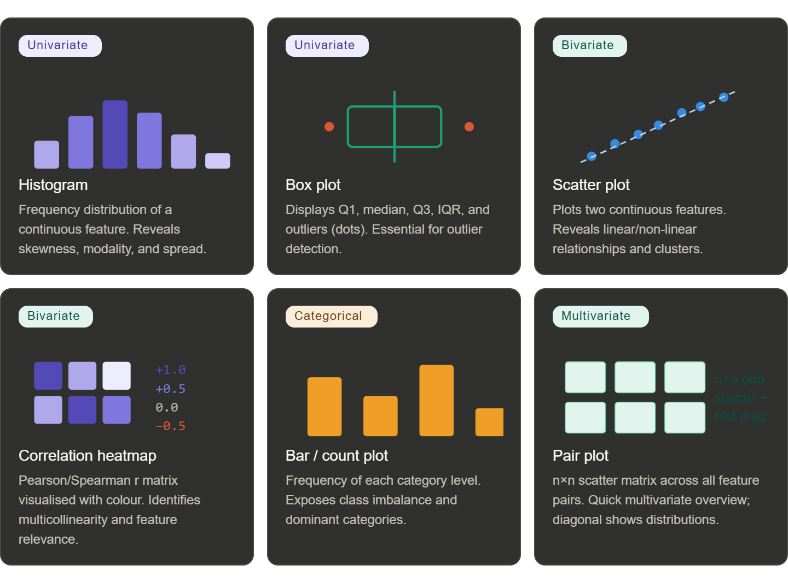

# 📊 MLF Notes — Data Processing, EDA & Regression

---

# 🔹 1. Feature Engineering

Transforming raw data into meaningful features to improve model performance.

---

## 🧩 Missing Value Imputation

Real-world datasets often contain missing values due to:

* Sensor failures
* Data entry errors
* Dropped records

### 🔧 Techniques

* **Drop Missing Values**

  ```python
  df.dropna()
  ```

  ✔ Use when missing data is very small (MCAR)

* **Mean / Median Imputation**

  * Mean → for normal distribution
  * Median → for skewed data

* **Mode Imputation**

  * Used for categorical features

* **Advanced Methods**

  * KNN Imputer
  * MICE (Iterative Imputer)

---

## ⚖️ Imbalanced Dataset & SMOTE

Class imbalance:

* Example → 95% class 0, 5% class 1
* Model becomes biased toward majority class

### ✅ SMOTE (Synthetic Minority Oversampling Technique)

* Generates synthetic samples (not duplicates)
* Uses nearest neighbors

**Steps:**

1. Select minority sample
2. Find k-nearest neighbors
3. Generate synthetic points

✔ Reduces overfitting
✔ Improves minority class prediction

---

## 🚨 Outlier Handling

Outliers = extreme values outside normal distribution

### 🔍 Detection Methods

* **IQR Method**

  * Range:

    ```
    [Q1 − 1.5×IQR, Q3 + 1.5×IQR]
    ```

* **Z-Score Method**

  * Flags values beyond ±3σ

### 🛠 Treatment

* Capping / Winsorization
* Transformation (log, sqrt)
* Removal

---

# 🔹 2. Data Encoding

ML models require numerical input.

| Method           | Use Case     | Notes                  |
| ---------------- | ------------ | ---------------------- |
| One-Hot Encoding | Nominal      | Creates binary columns |
| Label Encoding   | Tree models  | Assigns integers       |
| Ordinal Encoding | Ordered data | Preserves rank         |
| Target Encoding  | Supervised   | Based on target mean   |

---

# 🔹 3. EDA (Exploratory Data Analysis)

Statistical + visual analysis before modeling.



### 🎯 Goals:

* Understand distributions
* Detect outliers
* Identify correlations
* Spot anomalies

---

# 🔹 4. Dataset-Specific EDA

### 🍷 Red Wine Dataset

* Target: **Quality (3–8)**
* Key Features:

  * Alcohol
  * Volatile acidity
  * Sulphates

**Focus:**

* Correlation with quality
* Class imbalance

---

### ✈️ Flight Price Dataset

* Target: **Price (continuous)**

**Focus:**

* Feature engineering:

  * Duration
  * Stops
  * Airline
  * Departure time

✔ Handle mixed data types
✔ Extract datetime features

---

# 🔹 5. ML Workflow

```
Raw Data → EDA → Feature Engineering → Encoding/Scaling → Train/Test Split → Model
```

📌 Key Insight:
EDA drives feature engineering decisions.

---

# 📐 6. Regression in Supervised ML

Supervised learning → model learns from labeled data
Regression → predicts continuous values

---

## 📉 6.1 Simple Linear Regression

Relationship between X and Y:

```
Y = mX + b
```

* m → slope
* b → intercept

**Example:** Predict house price from size

---

## 📊 6.2 Regression Equations

```
m = Σ(Xi - X̄)(Yi - Ȳ) / Σ(Xi - X̄)²
b = Ȳ - mX̄
```

✔ Minimizes prediction error

---

## 🎯 6.3 Cost Function (MSE)

```
Cost = (1/n) Σ(Ypred - Yactual)²
```

✔ Measures model error
✔ Goal = minimize cost

---

## 🔄 6.4 Gradient Descent

Steps:

1. Initialize weights
2. Compute gradient
3. Update weights:

   ```
   m = m - α (∂Cost/∂m)
   ```
4. Repeat

**α (learning rate):**

* Too high → overshoot
* Too low → slow convergence

---

## 📈 6.5 Multiple Linear Regression

```
Y = b + m1X1 + m2X2 + ... + mnXn
```

✔ Uses multiple features

---

## 📏 6.6 Performance Metrics

| Metric | Formula                  | Meaning                |   |           |
| ------ | ------------------------ | ---------------------- | - | --------- |
| MAE    | (1/n)Σ                   | Ypred - Yactual        |   | Avg error |
| MSE    | (1/n)Σ(Ypred - Yactual)² | Penalizes large errors |   |           |
| RMSE   | √MSE                     | Same unit as output    |   |           |

✔ Lower = better

---

## ⚠️ 6.7 Overfitting vs Underfitting

| Problem      | Meaning          | Solution                  |
| ------------ | ---------------- | ------------------------- |
| Underfitting | Model too simple | Increase complexity       |
| Overfitting  | Memorizes data   | Regularization, more data |
| Good Fit     | Generalizes well | ✅ Goal                    |

---

## 🔄 6.8 Polynomial Regression

```
Y = b + m1X + m2X² + m3X³ + ...
```

✔ Handles non-linear relationships

⚠️ High degree → overfitting risk

---

## ⚡ Final Quick Revision

* Feature engineering → improves data quality
* SMOTE → handles imbalance
* IQR/Z-score → detect outliers
* Encoding → convert categorical → numeric
* EDA → understand data before modeling
* Regression → predict continuous values
* Gradient descent → optimize model
* Overfitting → memorize ❌
* Underfitting → too simple ❌

---
