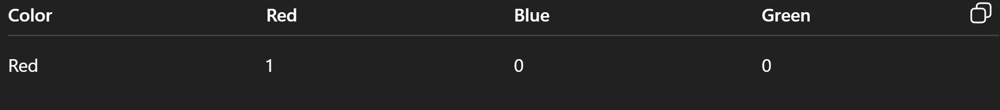
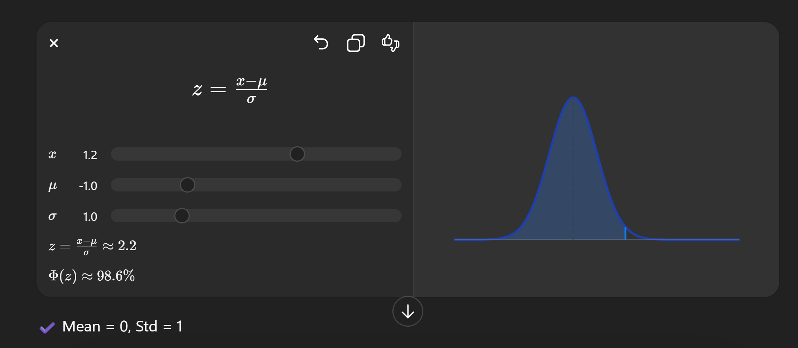
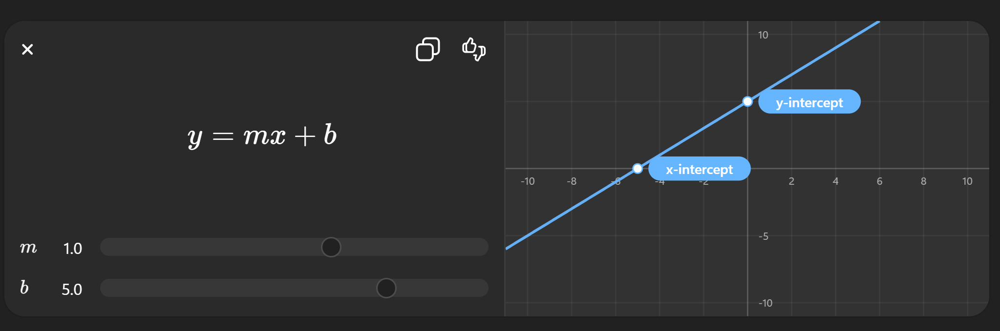
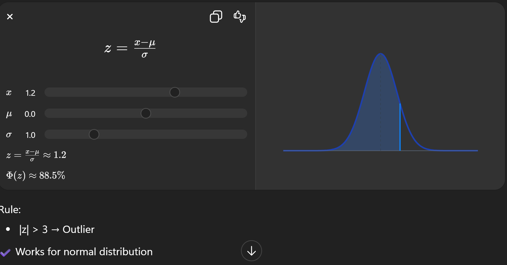

## 🔹 1. Types of Encoding

### ✅ Nominal Encoding
    Used for categorical data with no order
    Example: Color → {Red, Blue, Green}
    Usually done via One-Hot Encoding

---

### ✅ Ordinal Encoding
    Used when order matters
    Example: Low < Medium < High
    Assign numbers:
    Low = 1, Medium = 2, High = 3

---

### ✅ One-Hot Encoding
    Converts categories into binary columns
    

✔ Avoids false ordering
❌ Increases dimensionality

---

### ✅ Label Encoding
    Assigns integer value to each category
    Example:
    Dog = 0, Cat = 1, Cow = 2

**⚠ Problem: Model may assume order (0 < 1 < 2)**

---

### ✅ Frequency Encoding
    Replace category with its frequency/count
City	Count
---------------
Delhi	50
Jaipur	20

**✔ Useful for large datasets**

---

## 🔹 2. SMOTE Technique
**👉 Full Form: Synthetic Minority Oversampling Technique**

    Used for imbalanced datasets
    Creates synthetic samples for minority class
**💡 How it works:**

    Pick minority sample
    Find nearest neighbors
    Create synthetic points between them

**✔ Avoids overfitting vs simple duplication**
**✔ Improves model performance**

## 🔹 3. Five Number Summary

Used to describe data distribution:

    **Min, Q1, Median, Q3, Max**

**Components:**

    Min → smallest value
    Q1 → 25th percentile
    Median (Q2) → 50th percentile
    Q3 → 75th percentile
    Max → largest value

**✔ Used in box plots**
**✔ Helps detect outliers**

---

## 🔹 4. Variable & Random Variable

### ✅ Variable
    Any measurable feature
    Example: Age, Height, Marks

--- 

✅ Random Variable

    Variable whose value depends on chance

**Types:**

    Discrete → Countable (dice roll)
    Continuous → Range (height, weight)

---

## 🔹 5. Types of Data

### 🔢 Numerical Data
    Quantitative values

**Types:**

    Discrete → integers (no. of students)
    Continuous → real values (temperature)

---

### 🔤 Categorical Data
    Qualitative

**Types:**

    Nominal → no order (color)
    Ordinal → ordered (rank)

---

## 🔹 6. Scikit-Learn Tools

## ✅ StandardScaler
Standardizes data

---

### ✅ OneHotEncoder
Converts categorical → binary columns

---

### ✅ SimpleImputer
    Fills missing values

**Strategies:**
    mean
    median
    most_frequent

---

### ✅ Linear Regression
    Predicts continuous output

✔ Supervised learning
✔ Finds best-fit line

---

## 🔹 7. Outlier Detection

### ✅ Z-Score Method

---

### ✅ IQR Method

𝐼𝑄𝑅 = Q3 - Q1

**Outlier range:**

    Lower = Q1 − 1.5 × IQR
    Upper = Q3 + 1.5 × IQR

✔ More robust than Z-score

---

## 🔹 8. Histogram (Positive Skew)

### ✅ Positive Skew (Right Skewed)
Tail extends to the right
Most values are small
Relation:
Mean > Median > Mode

✔ Example: Income distribution
