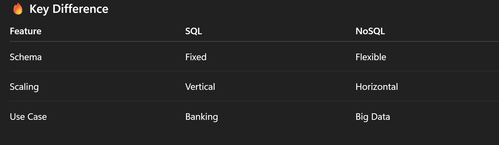

# 🚀 UNIT 3 — SYSTEM DESIGN

## 🌐 1. How Google Works (DNS + Handshake)

### 🔹 Step 1: DNS Resolution

You type: google.com

-> Browser asks: “What is the IP?”

->DNS (Domain Name System) translates:

    - google.com → 142.250.xxx.xxx

**📌 Think: DNS = Internet’s phonebook**

---

### 🔹 Step 2: TCP Handshake (3-Way)

**Connection setup between client & server:**

1. **SYN** → Client: “Can we connect?”
2. **SYN-ACK** → Server: “Yes, I’m ready”
3. **ACK** → Client: “Let’s go”

**📌 Ensures:**
-Reliability
-Synchronization

---

### 🔹 Step 3: HTTP Request/Response
-   Browser sends request
-   Server returns HTML, CSS, JS

--- 

### 🔹 TLS (HTTPS)
-   Encryption layer added after TCP
-   Protects data (passwords, etc.)

--- 

## 2. Two-Way vs Three-Way Handshake

### 🔹 2-Way Handshake
-   SYN → SYN-ACK
        ❌ Problem:
-   No confirmation from client
-   Can cause **half-open** connections

---

### 🔹 3-Way Handshake (Used)
-   SYN → SYN-ACK → ACK
        ✅ Reliable because:
-   Both sides confirm readiness

**📌 Interview line:**
    **3-way handshake prevents stale/duplicate connections.**

---

## 🧠 3. Database Indexing

### 🔹 What is it?

**A data structure that improves search speed.**

**📌 Without index:**
    -   Full table scan → slow

**📌 With index:**
    -   Direct lookup → fast

---------------------------------------------

### 🔹 Example

    SELECT * FROM students WHERE roll_no = 101;

-   Without index → scan all rows
-   With index → jump directly

### 🔹 Types

-   **Primary Index**
-   **Secondary Index**
-   **B-Tree Index (most common)**
-   **Hash Index**

---

### 🔹 Trade-offs

**✔** Fast reads
**❌** Slower writes (index must update)
**❌** Extra memory

---

## 🔥 4. Thrashing (OS Concept)

### 🔹 What is it?
**System spends more time swapping pages than executing**
-----------------------------------------------------------------------
### 🔹 Why it happens?
-   Too many processes
-   Not enough RAM
-   High page faults
--------------------------------------------------------------------------
### 🔹 Result

**❌** CPU utilization drops
**❌** System becomes slow
----------------------------------------------------------------------------
### 🔹 Solution

-   Increase RAM
-   Reduce multiprogramming
-   Use better page replacement (LRU)

---

## 🗄️ 5. Database Sharing

### 🔹 Meaning
**Multiple users/applications accessing same DB**
--------------------------------------------------------------------------------
### 🔹 Types
1. Centralized DB
    •   One server
2. Distributed DB
    •   Data spread across locations
3. Cloud DB
    •   Shared over internet (AWS, GCP)

----------------------------------------------------------------------------------
### 🔹 Problems
-   Concurrency issues
-   Data consistency
-   Deadlocks

--- 

## 🧾 6. SQL vs NoSQL

### 🔹 SQL (Relational)
-   Structured tables
-   Fixed schema

#### Examples:
-   **MySQL**
-   **PostgreSQL**

**✔** Strong consistency
**✔** ACID properties
----------------------------------------------------------------------------------------------
### 🔹 NoSQL (Non-Relational)
-   Flexible schema
-   JSON-like data

#### Examples:

-   MongoDB
-   Cassandra

**✔** Scalable
**✔** Fast for large data

## ⚖️ 7. Consistent Hashing

### 🔹 What is it?
**Technique to distribute data across servers efficiently**
----------------------------------------------------------------
### 🔹 Problem it solves
**When servers are added/removed:**
-   Normal hashing → massive reshuffling ❌
-   Consistent hashing → minimal changes ✅
--------------------------------------------------------------------
### 🔹 How it works
-   Imagine a circular ring
-   Servers + data mapped on ring
-   Data goes to nearest server clockwise
-----------------------------------------------------------------------
### 🔹 Benefits

**✔** Load balancing
**✔** Fault tolerance
**✔** Scalable systems

#### 📌 Used in:

-   Distributed caches
-   CDNs
-   Databases (e.g., Cassandra)

---

## ⚡ Final Revision (Quick Recall)

-   DNS → domain → IP
-   3-way handshake → reliable connection
-   Indexing → faster queries
-   Thrashing → too many page faults
-   DB sharing → multiple users, concurrency issues
-   SQL vs NoSQL → structure vs flexibility
-   Consistent hashing → scalable distribution